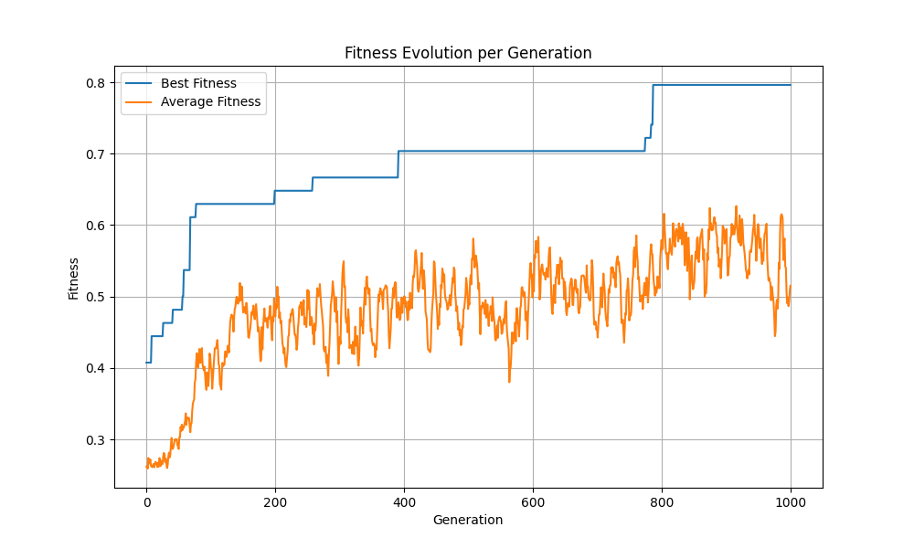
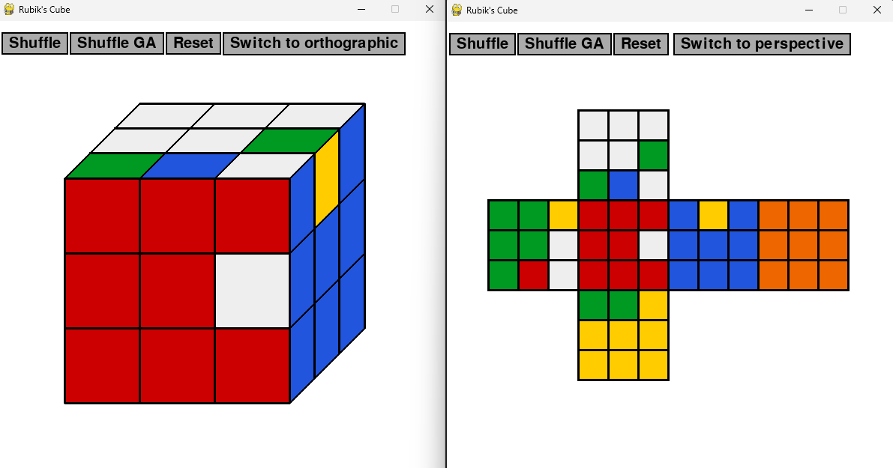
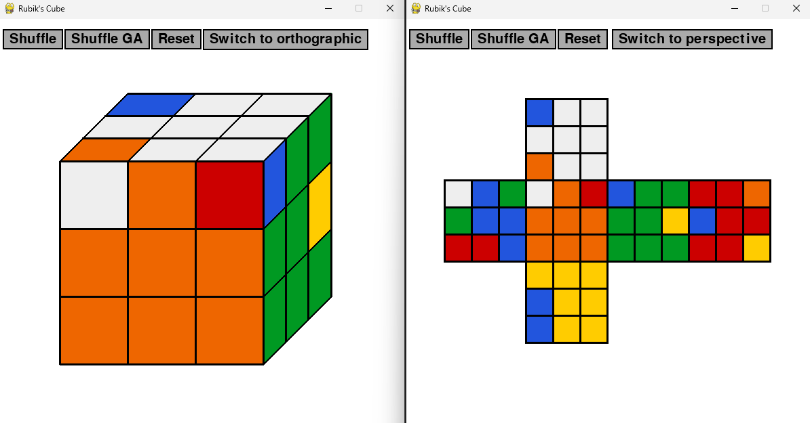

# Rubik’s Cube Solver – Genetic Algorithm Approach

## Project Overview

This project is a **Python-based Rubik’s Cube solver** using a **Genetic Algorithm (GA)**.
The main goal is to evolve sequences of moves that **solve the entire cube in a single end-to-end attempt**. This is implemented and tested in the `run_ga_end_to_end.py` script.

Additionally, a **stage-based approach** is tested, gradually solving:

1. White cross
2. First layer
3. Second layer
4. Full cube

This stage-based solving demonstrates GA application in smaller, manageable steps. Both approaches are experimental: the cube may not be fully solved in all runs, but the framework showcases GA optimization for combinatorial problems.

The project also includes a **Pygame-based visualizer** with perspective and orthographic views, allowing interactive manipulation and move visualization.

---

## Features

* Representation of a **3×3×3 Rubik’s Cube** in Python
* GA solver with:

  * Population initialization (variable-length chromosomes representing sequence of moves)
  * Fitness evaluation (correct tiles / cubies position): evaluates solutions either by the percentage of correctly placed stickers (correct tiles) or by the percentage of correctly positioned and oriented pieces (cubies position).
  * Selection: tournament / roulette / exponential ranking
  * Crossover (one-point)
  * Mutation (modifies/adds/removes moves)
  * Elite preservation
* **End-to-end cube solving experiment**
* **Stage-based solving experiment**
* Interactive Pygame GUI:

  * Shuffle (random and GA-based)
  * Reset cube
  * Switch views (perspective / orthographic)
  * Keyboard control for moves and rotations
* Ability to run multiple GA experiments and track statistics

---

## Project Structure

| File                 | Description                                                                                         |
| -------------------- | --------------------------------------------------------------------------------------------------- |
| `run_visual.py`        | Pygame GUI loop for interactive cube manipulation.                                                  |
| `run_ga_stages.py`      | Stage-based GA solver script (white cross → first layer → second layer → full cube).                |
| `run_ga_end_to_end.py` | End-to-end GA solver experiments: attempts to solve the entire cube at once, tracks statistics.     |
| `rubiks_solver/cube.py`            | Contains the `Cube` class: cube representation, moves, rotations, shuffle, copy, and reset methods. |
| `rubiks_solver/ga.py`              | Genetic Algorithm implementation with `GASolver` and `Individual` classes.                          |
| `rubiks_solver/render.py`          | Rendering functions for perspective and orthographic views, plus button drawing.                    |
| `rubiks_solver/controls.py`        | Keyboard input handling for cube moves and rotations.                                               |
| `rubiks_solver/config.py`          | Configuration constants (screen size, GA parameters, shuffle sequences, cube stages, colors, etc.)  |
| `tests/`          | Tests folder  |
---

## Usage

### Interactive GUI

```bash
python run_visual.py
```

* Use buttons to shuffle or reset the cube
* Use keyboard:

  * `F, R, U, D, L, B` – clockwise moves
  * `Shift + key` – counterclockwise move
  * `X, Y, Z` – rotate cube along axes

### Stage-Based GA Solver

```bash
python run_ga_stages.py
```

* Executes GA in **stages**:

  1. White cross
  2. First layer
  3. Second layer
  4. Full cube (attempt)
* Prints best fitness and sequences for each stage
* Stops on failure if GA cannot find a complete stage solution

### End-to-End GA Experiments

```bash
python run_ga_end_to_end.py
```

* Attempts to solve the **entire cube in a single GA run**
* Tracks best fitness, elapsed time, and best sequence over multiple runs
* Prints summary statistics:

  * Average best fitness
  * Average execution time
  * Best sequence across all runs

### Tests
```bash
python -m pytest tests/
```
* Testing `GASolver` and `Cube` classes functionality
---

## Configuration

GA parameters and cube stages can be adjusted in `config.py`:

* `POPULATION_SIZE` – number of individuals per generation
* `MAX_GENERATIONS` – max generations per run
* `CROSSOVER_RATE`, `MUTATION_RATE` – GA probabilities
* `SHUFFLE_SEQUENCE` – predefined scramble sequence
* `STAGES_TILES` / `STAGES_CUBIES` – target states for stage evaluation

---

## Results and Analysis

### Fitness Evaluation Methods

Two different fitness evaluation approaches were tested in the genetic algorithm:

1. **Correct Tiles** – fitness is computed as the percentage of correctly placed stickers.  
   This method yielded the best results, reaching up to **80% fitness** in the most successful runs. The progression of fitness was relatively stable across generations.

2. **Cubies Position** – fitness is based on the percentage of cubies in the correct position and orientation.  
   This approach produced slightly lower and less stable results compared to the correct tiles method.

### Fitness Evolution

The following plot shows the evolution of fitness over generations for the selected evaluation method:



### Cube State After Applying Final Sequence

After applying the best solution sequence from the genetic algorithm, the resulting cube states are shown below:

**Example 1 (correct tilles evaluation method):**  


**Example 2 (cubies orientation and position evaluation method):**  


### End-to-End vs Stage-Wise Approach

A **stage-wise approach** was also tested, where the cube was solved in multiple stages (white cross, first layer, second layer, full cube).  
Although the first two stages could be solved successfully, this strategy **did not facilitate further cube solving**. The staged solutions did not simplify solving the full cube, making the end-to-end approach more effective in practice.

> Note: Full cube solving is highly challenging; the GA may not achieve a complete solution in all runs. The project is primarily a **proof-of-concept for GA optimization on combinatorial puzzles**.

---

## Dependencies

* Python ≥ 3.8
* `pygame` – for GUI and visualization
* `pytest` - for test

Install dependencies:

```bash
pip install pygame pytest
```